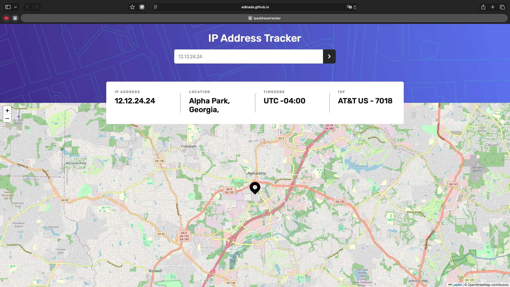
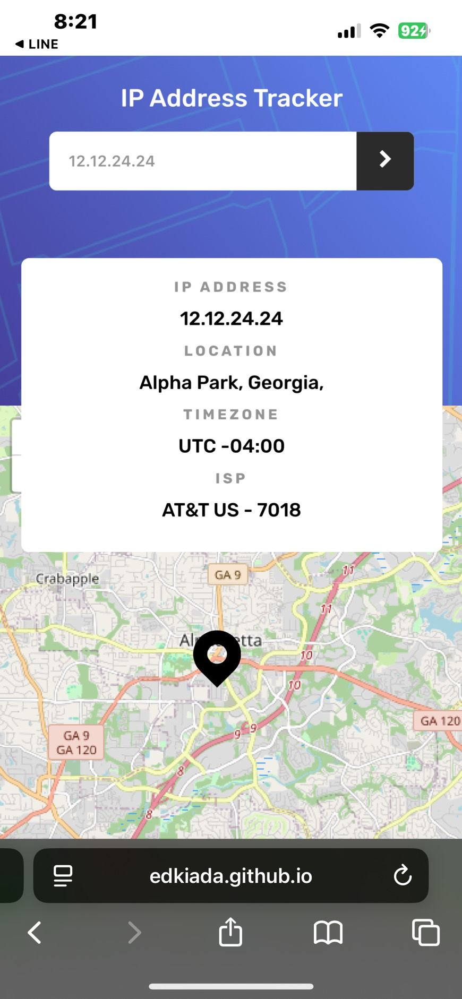

# Frontend Mentor - IP address tracker solution

This is a solution to the [IP address tracker challenge on Frontend Mentor](https://www.frontendmentor.io/challenges/ip-address-tracker-I8-0yYAH0). 

## Table of contents

- [Overview](#overview)
  - [The challenge](#the-challenge)
  - [Screenshot](#screenshot)
  - [Links](#links)
- [My process](#my-process)
  - [Built with](#built-with)
- [Author](#author)

## Overview

### The challenge

Users should be able to:

- View the optimal layout for each page depending on their device's screen size
- See hover states for all interactive elements on the page
- See their own IP address on the map on the initial page load
- Search for any IP addresses or domains and see the key information and location

### Screenshot

#### Desktop Version

#### Mobile Version

### Links

- Solution URL: [GitHub](https://github.com/edkiada/ipAddressTracker)
- Live Site URL: [Countries App](https://edkiada.github.io/ipAddressTracker/)

## My process

### Built with

- Semantic HTML5 markup
- CSS custom properties
- Flexbox
- Mobile-first workflow
- Responsive design
- [vue 3](https://vuejs.org/) - Reactive components via Composition API.
- [Vite](https://nextjs.org/) - Fast frontend build tool.
- [IPify](https://geo.ipify.org/) - To get the IP Address locations
- [LeafletJS](https://leafletjs.com/) - To generate the map

## Author

- GitHub - [@edkiada](https://github.com/edkiada)
- Frontend Mentor - [@edkiada](https://www.frontendmentor.io/profile/edkiada)
- Email - [yyh901277111@gmail.com](mailto:yyh901277111@gmail.com)
